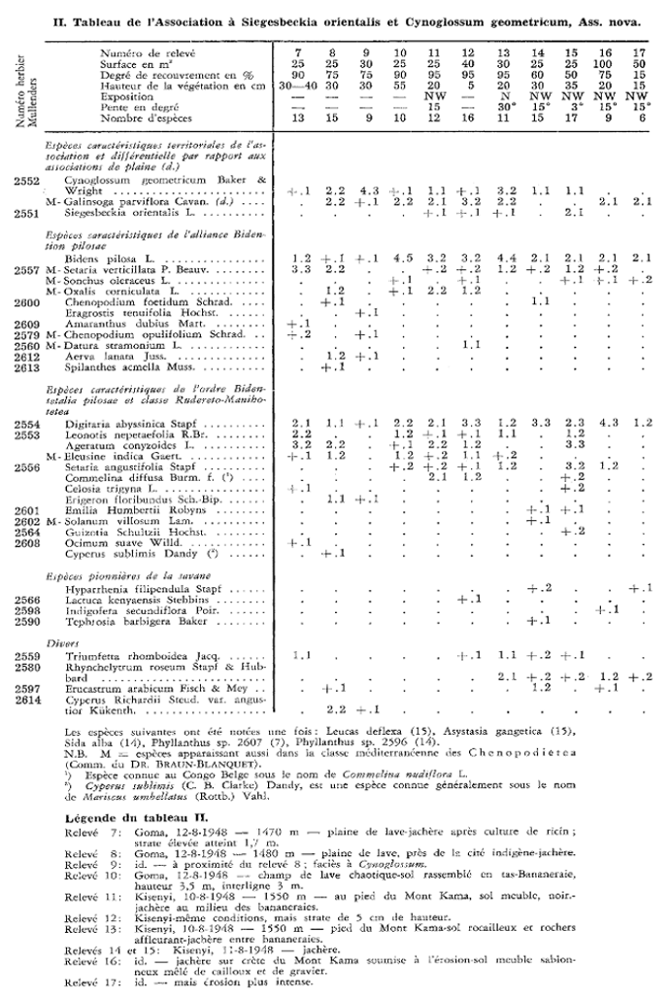

# 1. Getting started

The package `taxlist` aims to implement an object class and functions (methods)
for handling taxonomic data in **R**.
The homonymous object class `taxlist` can be further linked to biodiversity
records (e.g. for observations in vegetation plots).

The `taxlist` package is developed on the repository **GitHub**
([https://github.com/kamapu/taxlist](https://github.com/kamapu/taxlist)) and can
be installed in your R-session using the package `devtools`:

```{r install_github, eval=FALSE}
library(devtools)
install_github("kamapu/taxlist", build_vignettes=TRUE)
```

Since this package is already available in the Comprehensive R Archive Network
(CRAN), it is also possible to install it using the function
`install.packages`:

```{r install_cran, eval=FALSE}
install.packages("taxlist", dependencies=TRUE)
```

Of course, you have to load `taxlist` into your R-session.

```{r load_taxlist, message=FALSE}
library(taxlist)
```

For accessing to this vignette, use following command:

```{r call_vignette, eval=FALSE}
vignette("taxlist-intro")
```

# 2. Extracting a species list from a vegetation table

## 2.1 Example data

One of the main tasks of `taxlist` is to structure taxonomic information for a
further linkage to biodiversity records.
This structure have to be on the one side
consistent with taxonomic issues (e.g. synonyms, hierarchies, etc.), on the
other side have to be flexible for containing different depth of information
availability (from plain species lists to hierarchical structures).

In this guide, we will work with a species list from phytosociological
relev&eacute;s collected at the borderline between the
**Democratic Republic of the Congo** and **Rwanda** (Mullenders 1953
*Vegetatio* 4(2): 73--83).



The digitized data can be loaded by following command:

```{r load_example_table}
load(url("https://github.com/kamapu/thisdataismine/raw/master/data/Cross.rda"))
```

The data is formatted as `data.frame` in **R**, including the names of the
species in the first column:

```{r head_example}
head(Cross[ ,1:8])
```

## 2.2 From plain list to taxlist

As already mentioned, the first column in the cross table contains the names
of the species occurring in the observed plots.
Thus, we can use this character vector to construct a `taxlist` object.
This can be achieved through the function `df2taxlist`.

```{r character2taxlist}
Splist <- Cross[ ,"TaxonName"]
Splist <- df2taxlist(Splist)
summary(Splist)
```

Note that the function `summary` provides a quick overview in the content of
the resulting object.
This function can be also applied to a specific taxon:

```{r summary_character}
summary(Splist, "Erigeron floribundus")
```

# 3. Built-in data set

## 3.1 Easplist

The installation of `taxlist` includes the data `Easplist`, which is formatted
as a `taxlist` object.
This data is a subset of the species list used by the database **SWEA-Dataveg**
([GIVD ID AF-006](http://www.givd.info/ID/AF-00-006 "SWEA-Dataveg")):


```{r load_easplist}
data(Easplist)
Easplist
```


## 3.2 Access to slots

The common ways to access to the content of slots in `S4` objects are either
using the function `slot(object, name)` or the symbol `@` (i.e. `object@name`).
Additional functions, which are specific for `taxlist` objects are
`taxon_names`, `taxon_relations`, `taxon_traits` and `taxon_views` (see the help
documentation).

Additionally, it is possible to use the methods `$` and `[` , the first for
access to information in the slot `taxonTraits`, while the second can be also
used for other slots in the object.

```{r summary_life_forms}
summary(as.factor(Easplist$lf_behn_2018))
```


## 3.3 Subsets

Methods for the function `subset` are also implemented in this package.
Such subsets usually apply pattern matching (for character vectors) or logical
operations and are analogous to query building in relational databases.
The `subset` method can be apply to any slot by setting the value of the
argument `slot`.


```{r papyrus_otp1, results="hide"}
Papyrus <- subset(x=Easplist, subset=grepl("papyrus", TaxonName), slot="names")
summary(Papyrus, "all")
```

Or the very same results:

```{r papyrus_opt2, results="hide"}
Papyrus <- subset(x=Easplist, subset=TaxonConceptID == 206, slot="relations")
summary(Papyrus, "all")
```

Similarly, you can look for a specific name.

```{r phragmites, results="hide"}
Phraaus <- subset(x=Easplist,
		subset=charmatch("Phragmites australis", TaxonName), slot="names")
summary(Phraaus, "all")
```


## 3.4 Hierarchical structure

Objects belonging to the class `taxlist` can optionally content parent-child
relationships and taxonomic levels.
Such information is also included in the data `Easplist`, as shown in the
summary output.

```{r summary_again}
Easplist
```

Note that such information can get lost once `subset()` has been applied, since
the respective parents or children from the original data set are not anymore in
the subset.
May you like to recover parents and children, you can use the functions
`get_parents` or `get_children`, respectively.

```{r recover_parents}
summary(Papyrus, "all")
Papyrus <- get_parents(Easplist, Papyrus)
summary(Papyrus, "all")
```

# 4. Applying taxlist to syntaxonomic schemes

## 4.1 Example of a phytosociological classification

To illustrate the flexibility of the `taxlist` objects, the next example will
handle a syntaxonomical scheme.
As example it will be used a scheme proposed by the author for
aquatic and semi-aquatic vegetation in Tanzania (Alvarez 2017 *Phytocoenologia*
in review).
The scheme includes 10 associations classified into 4 classes:


## 4.2 Building the taxlist object

The content for the taxonomic list is included in a data frame and can be
downloaded by following command:

```{r load_syntax}
load(url("https://github.com/kamapu/Guides/raw/master/data/wetlands_syntax.rda"))
```

The data frame `Concepts` contains the list of syntaxon names that are
considered as accepted in the previous scheme.
This list will be used to insert the new concepts in the `taxlist` object.

```{r prototype}
head(Concepts)

Syntax <- new("taxlist")

levels(Syntax) <- c("association","alliance","order","class")

taxon_views(Syntax) <- data.frame(ViewID=1, Secundum="Alvarez (2017)",
		Author="Alvarez M", Year=2017,
        Title="Classification of aquatic and semi-aquatic vegetation in East Africa",
        stringsAsFactors=FALSE)

Syntax <- add_concept(Syntax, TaxonName=Concepts$TaxonName,
		AuthorName=Concepts$AuthorName, Parent=Concepts$Parent,
		Level=Concepts$Level, ViewID=rep(1, nrow(Concepts)))

Syntax
```

Note that the function `new` created an empty object (prototype), while
`levels` insert the custom levels (syntaxonomical hierarchies).
For the later function, the levels have to be inserted from the lower to the
higher ranks.
Furthermore the reference defining the concepts included in the syntaxonomic
scheme was inserted in the object using the function `taxon_views` and finally
the concepts were inserted by the function `add_concept`.

The next step will be inserting those names that are considered as synonyms for
the respective syntaxa.
Synonyms are included in the data frame `Synonyms`.

```{r adding_synonyms}
head(Synonyms)
Syntax <- add_synonym(Syntax, ConceptID=Synonyms$TaxonConceptID,
		TaxonName=Synonyms$TaxonName, AuthorName=Synonyms$AuthorName)
```

Finally, the codes provided for the associations will be inserted as traits
properties) of them in the slot `taxonTraits`.

```{r adding_traits}
head(Codes)
taxon_traits(Syntax) <- Codes
Syntax
```

For instance, you may like to get the parental chain from an association (e.g.
for *Nymphaeetum loti*).

```{r get_nymplot}
Nymplot <- subset(Syntax, charmatch("Nymphaeetum", TaxonName), slot="names")
summary(Nymplot, "all")
```

Note that there is the logical arguments `keep_parents` and `keep_children` to
preserve hierarchical information in the subset:

```{r get_nymplot_2}
Nymplot <- subset(Syntax, charmatch("Nymphaeetum", TaxonName), slot="names",
	keep_parents=TRUE)
summary(Nymplot, "all")
```

By using the function `subset` we just created a new object containing only the
association *Nymphaeetum loti* and its parental chain.
This subset was then used to extract the parental chain from `Syntax`.
